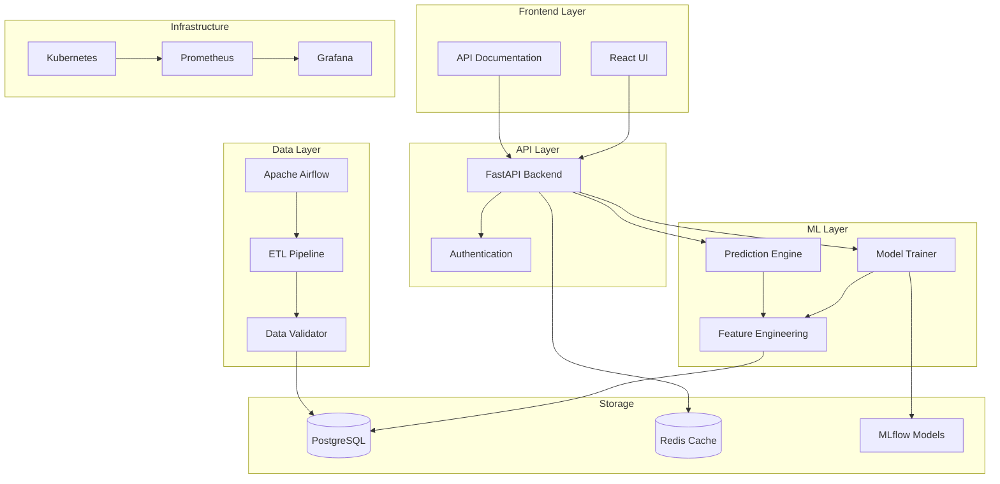

# Crypto Forecasting Platform

Welcome to the **Crypto Forecasting Platform** documentation - your comprehensive guide to our enterprise-grade ML platform for cryptocurrency price prediction.

## Overview

The Crypto Forecasting Platform is a production-ready system that combines advanced machine learning algorithms, robust data pipelines, and modern DevOps practices to deliver accurate cryptocurrency price predictions.

## Key Features

- 🤖 **Multiple ML Models**: Random Forest, XGBoost, Decision Tree, Lasso, and Deep Learning models
- 📊 **Advanced Feature Engineering**: 50+ technical indicators and market signals
- 🔄 **Automated Data Pipeline**: Apache Airflow orchestration with real-time data ingestion
- 🚀 **Production-Ready Infrastructure**: Kubernetes, Docker, Helm, and Ansible automation
- 📈 **Comprehensive Monitoring**: Prometheus metrics with Grafana dashboards
- 🔒 **Enterprise Security**: Network policies, RBAC, secrets management
- 💾 **Disaster Recovery**: Automated backup and recovery procedures
- 🎯 **RESTful API**: Fast and scalable FastAPI backend with interactive documentation

## Quick Links

| Resource | Description |
|----------|-------------|
| [Quick Start](getting-started/quickstart.md) | Get up and running in 5 minutes |
| [API Reference](api/rest-api.md) | Complete API documentation |
| [ML Models](ml/models/random-forest.md) | Machine learning model details |
| [Deployment Guide](deployment/kubernetes.md) | Production deployment instructions |
| [Troubleshooting](troubleshooting/common-issues.md) | Solutions to common problems |

## System Architecture



## Technology Stack

### Machine Learning
- **Scikit-learn**: Traditional ML algorithms
- **XGBoost**: Gradient boosting
- **PyTorch**: Deep learning models
- **MLflow**: Experiment tracking and model registry

### Backend
- **FastAPI**: High-performance REST API
- **PostgreSQL**: Primary database
- **Redis**: Caching and session management
- **SQLAlchemy**: ORM and database migrations

### Infrastructure
- **Docker**: Containerization
- **Kubernetes**: Container orchestration
- **Helm**: Kubernetes package management
- **Ansible**: Infrastructure automation

### Monitoring
- **Prometheus**: Metrics collection
- **Grafana**: Visualization and dashboards
- **Alert Manager**: Intelligent alerting

## Getting Started

### Prerequisites

- Docker & Docker Compose
- Kubernetes cluster (minikube/kind for development)
- Python 3.12+
- Helm 3.x
- Ansible 2.16+

### Quick Installation

=== "Docker Compose"

    ```bash
    # Clone the repository
    git clone https://github.com/crypto-forecasting/platform
    cd platform
    
    # Start with Docker Compose
    docker-compose up -d
    
    # Access the application
    open http://localhost:8501
    ```

=== "Kubernetes"

    ```bash
    # Deploy with Helm
    cd helm
    ./helm-manage.sh deploy
    
    # Check deployment
    kubectl get pods -n crypto-forecasting
    ```

=== "Ansible"

    ```bash
    # Complete automation
    cd ansible
    ./ansible-manage.sh setup
    ./ansible-manage.sh deploy
    ```

## Documentation Structure

This documentation is organized into the following sections:

- **Getting Started**: Installation, configuration, and your first prediction
- **Architecture**: System design, database schema, and technical details
- **API Reference**: Complete REST API documentation with examples
- **Machine Learning**: Model details, feature engineering, and training pipelines
- **Data Pipeline**: ETL processes, Airflow DAGs, and data validation
- **Deployment**: Production deployment guides for various platforms
- **Operations**: Monitoring, logging, backup, and performance tuning
- **Development**: Contributing guidelines, testing, and debugging
- **Troubleshooting**: Common issues and solutions

## Support

- 📧 Email: support@crypto-forecasting.example.com
- 💬 Slack: [Join our workspace](https://crypto-forecasting.slack.com)
- 🐛 Issues: [GitHub Issues](https://github.com/crypto-forecasting/platform/issues)
- 📚 Wiki: [Project Wiki](https://github.com/crypto-forecasting/platform/wiki)

## License

This project is licensed under the MIT License - see the [LICENSE](https://github.com/crypto-forecasting/platform/blob/main/LICENSE) file for details.

---

**Version:** 2.0.0 | **Last Updated:** October 2024
